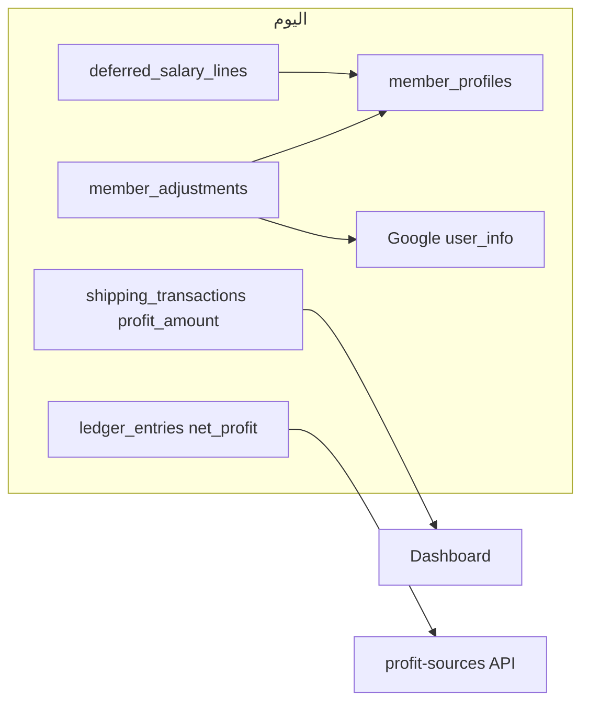

# خطة تنفيذ طلبات التحسين (مجمّعة)

## سياق سريع من الكود الحالي

- **تعديل راتب Google Sheet**: المنطق في `[services/memberAdjustmentSheetsSync.js](services/memberAdjustmentSheetsSync.js)` يحسب `next` بـ `Math.round(...*100)/100` ثم يكتب قيمة رقمية. أي ظهور كـ `100` بدل `100.65` قد يكون بسبب **تنسيق خلية في الشيت** (عرض كعدد صحيح)، أو **تقريب إضافي** في مسار آخر؛ يُراجع تعيين `valueInputOption` وإمكانية تمرير القيمة كنص تنسيق عشري صريح.
- **ربح الشحن في «مصادر الربح»**: الصفحة `[public/js/profit-sources.js](public/js/profit-sources.js)` تعتمد على `GET /api/expenses/net-profit-by-source` (دفتر `ledger_entries` فقط). ربح الشحن الفعلي يُجمع في اللوحة من `[routes/dashboard.js](routes/dashboard.js)` عبر `SUM(profit_amount)` من `shipping_transactions` وليس كـ `net_profit` في الدفتر (`[routes/shipping.js](routes/shipping.js)` يستخدم `ledger` لـ `expense`/`main_cash` بدون `net_profit`). لذلك «عدم ظهور ربح الشحن» في سجل الأرباح **سلوك معماري حالي** وليس خللاً فقط في التسمية.
- **نسب الوكالة**: تُخزَّن لكل دورة في `[sub_agency_cycle_settings](services/agencySyncService.js)` (مثل `commission_percent` / `company_percent`). يحتاج واجهة تعرض القيمة لكل دورة مُختارة.
- **المؤجل**: `member_profiles.deferred_balance_usd` يُحدَّث من `[refreshMemberDeferredSnapshot](services/memberDirectoryService.js)` من `deferred_salary_lines`؛ منطق الخصم في `[memberAdjustmentsService.js](services/memberAdjustmentsService.js)` يستخدم `deferred_balance_usd` + `total_salary_audited_usd` — يجب التأكد أن «المؤجل» كما يفهمه المستخدم يطابق **مجموع المؤجل عبر الدورات** وليس لقطة قديمة.

---

## المرحلة 1 — إصلاحات سريعة ودقة (1، 5، 6، 9)

| #     | المطلوب                                        | التوجه التقني                                                                                                                                                                                                                                                                           |
| ----- | ---------------------------------------------- | --------------------------------------------------------------------------------------------------------------------------------------------------------------------------------------------------------------------------------------------------------------------------------------- |
| **1** | كسور صحيحة في الشيت بعد الإضافة/الخصم          | مراجعة التحديث في `[memberAdjustmentSheetsSync.js](services/memberAdjustmentSheetsSync.js)`: التأكد من أن القيمة المكتوبة تحافظ على منزلتين عشريتين (مثلاً `toFixed(2)` كنص إذا لزم، أو `RAW`/`USER_ENTERED` مع التحقق من تنسيق العمود في الجدول). اختبار يدوي: 90.65 + 10 = 100.65.    |
| **5** | آخر دورة مالية مختارة تلقائياً في «ملف الوكيل» | تحديد الصفحة المقصودة (غالباً `[views/partials/payroll-google.ejs](views/partials/payroll-google.ejs)` + JS): عند التحميل، جلب `SELECT id FROM financial_cycles WHERE user_id = ? ORDER BY created_at DESC LIMIT 1` وتعيين `select` الدورة.                                             |
| **6** | قائمة منسدلة لدورات المالية في إضافات/خصومات   | بدل `input` رقمي في `[views/partials/member-adjustments.ejs](views/partials/member-adjustments.ejs)`: استدعاء API موجود أو إضافة `GET /api/.../cycles` (نمط مشابه لـ `[routes/subAgencies.js](routes/subAgencies.js)` أو `[routes/dashboard.js](routes/dashboard.js)`) وملء `<select>`. |
| **9** | إعادة تسمية «أرباح الإدارة: أعمدة Y+Z»         | تحديث: تسمية `audit_management_yz` في `[public/js/profit-sources.js](public/js/profit-sources.js)`، و`notes` في `[services/cycleAccountingService.js](services/cycleAccountingService.js)` عند الإدراج، وأي تقارير PDF إن وُجدت تشير لنفس النص («أرباح المكافات الشهرية»).              |

---

## المرحلة 2 — منطق أعمال وواجهات (2، 3، 4، 7، 8، 10، 11، 12، 13، 16، 22)

| #      | المطلوب                                                          | التوجه التقني                                                                                                                                                                                                                                                                                                                 |
| ------ | ---------------------------------------------------------------- | ----------------------------------------------------------------------------------------------------------------------------------------------------------------------------------------------------------------------------------------------------------------------------------------------------------------------------- |
| **2**  | خصم/إضافة للمؤجل حتى لو كان «مؤجل» فقط                           | مواءمة `member_profiles.deferred_balance_usd` مع مجموع `deferred_salary_lines` قبل/بعد التعديل؛ أو جعل `processAdjustment` يقرأ المجموع الحقيقي من `deferred_salary_lines` عند الحاجة. توثيق أن الخصم يطبق على المجموع المؤجل وليس فقط الحقول المسجّلة في الملف.                                                              |
| **3**  | سجل «حي» للصندوق الرئيسي: أحمر للسحب + الرصيد بعده، أخضر للإضافة | يتطلب مصدر بيانات موحّد: `[fund_ledger](db/schema.pg.sql)` + واجهة في `[public/js/funds.js](public/js/funds.js)` أو جزئية الصندوق (إن وُجدت) لعرض كل حركة بلون حسب إشارة `amount` ونص «الرصيد بعد العملية» (يُحسب تراكمياً أو يُخزَّن إن لزم). توسيع نفس النمط لـ «باقي السجلات» (نطاق واضح: الصندوق الرئيسي أولاً ثم تعميم). |
| **4**  | حفظ وعرض نسبة الوكالة الفرعية لكل دورة                           | واجهة الوكالات الفرعية (مثل `[views/partials/sub-agencies.ejs](views/partials/sub-agencies.ejs)` + JS): عند اختيار دورة، جلب `sub_agency_cycle_settings` وعرض النسبة المحفوظة؛ عند الحفظ، التأكد من `INSERT/UPDATE` على `sub_agency_cycle_settings`.                                                                          |
| **7**  | مرتجع من صندوق: مبلغ محدد، تعديل السجل، سجل حي                   | الاعتماد على `[routes/returns.js](routes/returns.js)` + `[services/returnsService.js](services/returnsService.js)`: إضافة حقول المبلغ المرتجع، ربط بـ `fund_ledger` أو السجل الأصلي، وتحديث سطر المرتجع بدل تكرار غير مرتبط.                                                                                                  |
| **8**  | صفحة مستقلة لكل «اسم عملية» في مصادر الربح                       | مسار جديد مثل `/profit-sources/:sourceType` أو query، مع API تفصيلي يفلتر `ledger_entries` حسب `source_type`؛ تعديل `[public/js/profit-sources.js](public/js/profit-sources.js)` لجعل الصف قابلاً للنقر.                                                                                                                      |
| **10** | ربح الشحن يظهر في سجل الأرباح                                    | خياران: (أ) دمج مصدرين في API مصادر الربح (دفتر + جدول شحن)، أو (ب) **mirror** قيود `net_profit` من `shipping_profit` عند البيع (يتطلب اتساق مع `[insertNetProfitLedgerAndMirrorFund](services/ledgerService.js)`). قرار منتج: عدم ازدواج مع بطاقة اللوحة.                                                                    |
| **11** | ترابط المستخدمين مع الشحن                                        | ربط `buyer_user_id` / `shipping_transactions` في استعلامات «بيانات المستخدمين» أو صفحة التفصيل (`[services/memberDirectoryService.js](services/memberDirectoryService.js)`).                                                                                                                                                  |
| **12** | مخزون 0 والشراء دين علينا                                        | تعديل مسار الشراء في `[routes/shipping.js](routes/shipping.js)`: إنشاء `entity_payables` أو مسار ديون موجود مسبقاً عند التفعيل.                                                                                                                                                                                               |
| **13** | «ديين لنا» يشمل فقط: معتمدين، وكالات فرعية، مستخدمين، مرتجع      | تصفية `[routes/dashboard.js](routes/dashboard.js)` / `[services/debtAggregation.js](services/debtAggregation.js)` أو صفحة `[views/partials/receivables-to-us.ejs](views/partials/receivables-to-us.ejs)` حسب تعريف المنتج.                                                                                                    |
| **16** | سجل لقسم «الوسائط المالية»                                       | تحديد المقصود (مؤسسات؟ وسائط تخزين؟): إذا كان قسماً جديداً، جدول + `fund_ledger` أو سجل مخصص + صفحة جزئية.                                                                                                                                                                                                                    |
| **22** | منطق عرض رصيد الشحن (1000 USD مقابل كمية 50000)                  | تعديل عرض في `[public/js/shipping.js](public/js/shipping.js)` والاستعلامات: إظهار **قيمة الشراء بالدولار** كرصيد قابل للاستخدام، مع إبقاء الكمية كحقل ثانوي.                                                                                                                                                                  |

---

## المرحلة 3 — نظام عرض موحّد للألوان والأنواع (19)

- تعريف **تصنيف** للعمليات: مرتجع / دين / صرف / رصيد (أو ما يعادلها) وربطها بـ `type` في `fund_ledger` و`ledger_entries` حيث ينطبق.
- طبقة CSS/مكوّن مشترك في الجداول (الصناديق، المعتمد، الوكالة، التحويل، الشحن، الديون، فرق التصريف، المصاريف، دين علينا، التقارير) — نطاق **كبير**؛ يُنفَّذ بعد توحيد أسماء الأنواع (مرتبط بـ **14**).

---

## المرحلة 4 — تسميات عربية موحّدة (14)

- خريطة `type` → عربي لـ: `[fund_ledger.type](db/schema.pg.sql)`، `ledger_entries.source_type`، أنواع مرتجعات، شحن، تحويل، ديون.
- يفضّل مصدر واحد مشترك (مثل `NET_PROFIT_SOURCE_LABELS` موسّع) يُستورد في الواجهات والتقارير.

---

## مؤجّل صراحةً (15، 17، 18، 20، 21، 23، 24)

- تقارير مبسطة، إعادة تصميم المؤجل، أزرار سريعة إضافية، إزاحة أيقونة PDF، تنقل بين ملفات الوكالات، تسوية، ملف محاسبي جديد — تُرك كـ backlog منفصل بعد إغلاق المراحل أعلاه.

---

## مخاطر واعتمادات

- **Google Sheets**: لا يُضمن تطابق تنسيق الخلية مع الكسور إلا بعد اختبار على نفس الملف.
- **ربح الشحن في الدفتر**: أي إضافة قيود `net_profit` يجب ألا تتضاعف مع بطاقة اللوحة الحالية إن بقيت `netProfit = shipping + ledger`.
- **نطاق 19**: يتطلب تدقيقاً في كل الشاشات؛ يُفضّل تقسيمه بعد 14.

