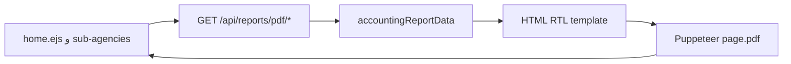

# خطة: تنزيل تقارير PDF (وكالات، اعتمادات، شركات، حركات، شامل)

## السياق الحالي

- لا يوجد مولّد PDF في [package.json](package.json) (يوجد `html2canvas` للواجهة فقط).
- البيانات موزّعة على جداول: `shipping_sub_agencies` + `[sub_agency_transactions](db/schema.pg.sql)`، `[accreditation_entities](db/schema.pg.sql)` + `accreditation_ledger`، `[transfer_companies](db/schema.pg.sql)` + `transfer_company_ledger`، `[ledger_entries](db/schema.pg.sql)`، `[fund_ledger](db/schema.pg.sql)`، وإضافات اختيارية لاحقة (مثل `shipping_transactions` إذا رغبت بإظهار «شحن» ضمن ملخص).
- `[financial_cycles](db/schema.pg.sql)` لا يحتوي تواريخ بداية/نهاية؛ تصفية «الدورة» تتم عبر `cycle_id` حيث يوجد في الجدول (مثل `ledger_entries`، `sub_agency_transactions`، `accreditation_ledger`). `**transfer_company_ledger` و`fund_ledger` لا يحتويان `cycle_id` في المخطط** — في التقرير يُعرضان **كاملاً** مع إشارة في الترويسة، أو يُفلتران حسب نطاق زمني لاحقاً إذا أضفت أعمدة/ربط.
- إحصائيات الملخص موجودة منطقياً في `[routes/dashboard.js](routes/dashboard.js)` (`/dashboard/stats`) — يُفضّل إعادة استخدام نفس الاستعلامات/الدوال عبر خدمة تجميع لتفادي ازدواجية.

## اختيار تقنية PDF والعربية

- **الخيار الموصى به للتقارير المحاسبية الطويلة والجداول**: توليد PDF من **HTML** (قالب بسيط RTL) باستخدام **Puppeteer** (أو Playwright) مع خط عربي من Google Fonts أو ملف `.ttf` مضمّن في المشروع. يعطي عرضاً جيداً للجداول والاتجاه من اليمين لليسار دون معالجة يدوية لكل حرف.
- **بديل أخف**: `pdfkit` + خط `Noto Naskh Arabic` + `arabic-reshaper` + `bidi-js` — يتطلب كود أكثر للجداول.

الخطة تفترض **Puppeteer** كمسار افتراضي؛ إن رغبت بتقليل حجم الاعتماديات لاحقاً يمكن استبدال طبقة التوليد فقط.

## التصميم الوظيفي

| نوع التقرير                    | المحتوى                                                                                                                                                   | معاملات                                              |
| ------------------------------ | --------------------------------------------------------------------------------------------------------------------------------------------------------- | ---------------------------------------------------- |
| وكالة فرعية واحدة              | اسم الوكالة، نسبة، رصيد، جدول `sub_agency_transactions` (مع `cycle_id` عند اختيار دورة)                                                                   | `subAgencyId`, `cycleId` (اختياري)                   |
| الاعتمادات                     | قائمة `accreditation_entities` + حركات `accreditation_ledger` (مفلترة بالدورة عند الوجود)                                                                 | `cycleId` (اختياري)                                  |
| شركات التحويل                  | شركات المستخدم + `transfer_company_ledger`                                                                                                                | — (بدون `cycle_id` في المخطط)                        |
| حركات (شامل الدفاتر كما اخترت) | أقسام: `ledger_entries`، `accreditation_ledger`، `transfer_company_ledger`، `sub_agency_transactions`، `fund_ledger` (مع أسماء الصناديع/الشركات عبر JOIN) | `cycleId` حيث ينطبق                                  |
| تقرير شامل                     | ترويسة + ملخص منطق `[/dashboard/stats](routes/dashboard.js)` + الأقسام الأربعة أعلاه في مستند واحد طويل                                                   | `cycleId` (اختياري للملخص والأقسام المرتبطة بالدورة) |

## الخلفية (Backend)

1. **خدمة تجميع بيانات** — ملف جديد مثل `[services/accountingReportData.js](services/accountingReportData.js)`:
  - دوال: `getSummaryForUser(db, userId, cycleId)`، `getSubAgencyReport(db, userId, subAgencyId, cycleId)`، `getAccreditationsReport(...)`، `getTransferCompaniesReport(...)`، `getAllLedgersMovements(...)`، `getComprehensiveReport(...)` (تستدعي الباقي).
  - كل استعلام يربط `user_id` ويتحقق من ملكية الدورة عبر `financial_cycles.user_id = $userId` عند استخدام `cycleId`.
2. **مولّد PDF** — مثل `[services/pdf/htmlAccountingPdf.js](services/pdf/htmlAccountingPdf.js)`:
  - قالب HTML بسيط (جدول، عناوين، `dir="rtl"`).
  - Puppeteer: `page.setContent(html, { waitUntil: 'networkidle0' })` ثم `page.pdf({ format: 'A4', printBackground: true })`.
  - إرجاع `Buffer` للـ route.
3. **مسارات HTTP** — مثل `[routes/reports.js](routes/reports.js)` مع `requireAuth`:
  - `GET /api/reports/pdf/sub-agency?subAgencyId=&cycleId=`
  - `GET /api/reports/pdf/accreditations?cycleId=`
  - `GET /api/reports/pdf/transfer-companies`
  - `GET /api/reports/pdf/movements?cycleId=`
  - `GET /api/reports/pdf/comprehensive?cycleId=`
  - `Content-Type: application/pdf` + `Content-Disposition: attachment; filename="..."` (أسماء ملفات عربية مع ترميز RFC 5987).
4. **التسجيل في** `[server.js](server.js)`: `app.use('/api/reports', reportsRoutes)`.

## الواجهة (Frontend)

- **الصفحة الرئيسية** `[views/partials/home.ejs](views/partials/home.ejs)`: بلوك بجانب اختيار الدورة: أزرار «تنزيل PDF» مع قائمة منسدلة (نوع التقرير: شامل / اعتمادات / شركات / حركات) + زر تنزيل؛ ربط بـ `homeCycleSelect` عند الحاجة.
- **الوكالات الفرعية** `[views/partials/sub-agencies.ejs](views/partials/sub-agencies.ejs)` + `[public/js/sub-agencies.js](public/js/sub-agencies.js)`: زر «تنزيل تقرير PDF» على بطاقة كل وكالة أو داخل لوحة الوكالة (مع `subAgencyId` + `cycleId` من `subAgencyCycleSelect`).
- **شركات التحويل / الاعتمادات** (إن وُجدت صفحات جزئية): زر تنزيل يفتح نفس مسار API المناسب — أو الاكتفاء بالمركزية من الصفحة الرئيسية في المرحلة الأولى لتقليل التفرقة.

تنفيذ التنزيل: `window.open` أو `fetch` + Blob + رابط مؤقت — مع تمرير الجلسة (cookies) لـ `GET` المحمي.

## اعتبارات الأداء والأمان

- التقارير الشاملة قد تكون ثقيلة: حد أقصى لعدد الصفوف لكل جدول في HTML (مثلاً 500–1000 سطر) مع سطر «… وتم إقتطاع الباقي» أو تقسيم صفحات PDF.
- التحقق من الصلاحيات على كل `id` (وكالة/دورة/شركة) تابع للمستخدم المسجّل.

## تبعيات npm

- `puppeteer` (أو `playwright` + `@playwright/test` غير مطلوب لـ PDF فقط — `playwright` core يكفي).
- إن اختيرت Puppeteer: احتمال وجود متغير بيئة `PUPPETEER_EXECUTABLE_PATH` على الخوادم بدون Chromium.

## مخطط تدفق مبسّط

