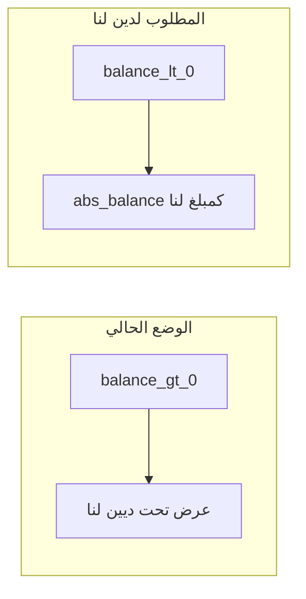

# خطة: ديين لنا (وكالات)، وترابط العمليات، وحذف البيانات

## 1) سبب الخطأ الحالي (الوكالات في «ديين لنا»)

في `[routes/subAgencies.js](routes/subAgencies.js)` التعليق يوضح المعنى المحاسبي:

- **رصيد موجب** للوكالة = الشركة مدينة للوكالة (الوكالة لها حق / دين علينا).
- **رصيد سالب** = الوكالة مدينة لنا.

في `[services/debtAggregation.js](services/debtAggregation.js)` الدالة `computeReceivablesToUs` تجمع **أرصدة موجبة** فقط من `sub_agency_transactions` (نفس صيغة `calculateAgencyBalance`). هذا يعني أن القسم يعرض فعلياً **ما للوكالة علينا**، وليس «دين لنا» — وهذا يطابق ملاحظتك في الصورة.

**التعديل المباشر (إصلاح سريع):** في استعلام الوكالات الفرعية داخل `computeReceivablesToUs`:

- استبدال شرط `HAVING ... > 0` بـ `**HAVING ... < -0.0001`** (أو ما يعادلها).
- إرجاع `**Math.abs(balance)`** في الحقل المعروض للواجهة (مثلاً `amount` أو `balance`) ليبقى الرقم موجباً بصيغة «مبلغ لنا».
- إعادة حساب `**totalUsd**` بحيث تُضاف مبالغ الوكالات من هذا المنطق فقط (وليس الأرصدة الموجبة السابقة).

تحديث الواجهة: في `[public/js/receivables-to-us.js](public/js/receivables-to-us.js)` و/أو `[views/partials/receivables-to-us.ejs](views/partials/receivables-to-us.ejs)` — نص توضيحي قصير: أن القسم يعرض الوكالات **التي رصيدها لصالحنا** (رصيد محاسبي سالب)، وإذا لم يوجد أي وكالة بهذا الوضع يظهر «لا توجد أرصدة موجبة» أو صياغة أدق مثل «لا يوجد دين لنا مسجل من الوكالات».

---

## 2) «ترابط متكامل» للتحويلات مقابل نصيب الربح (نطاق أوسع)

طلبك التفصيلي (مثال: تحويل ٣٠٠٠٠، نصيب ربحهم ٥٠٠٠ فيُسجَّل كـ ٥٠٠٠ «لنا»)، **لا يُستخرج بالكامل** من مجمع `sub_agency_transactions` الحالي إلا إذا كانت كل العمليات تُسجَّل بنفس النموذج الذي يعكس ذلك (تحويلات، سلف، أرباح، إلخ).

مسار مقترح على مرحلتين:

| المرحلة                | الهدف                                                            | الملفات / المفاهيم                                                                                                                                  |
| ---------------------- | ---------------------------------------------------------------- | --------------------------------------------------------------------------------------------------------------------------------------------------- |
| **أ**                  | إصلاح العرض والتجميع كما يطابق التعريف المحاسبي الحالي في الموقع | `[debtAggregation.js](services/debtAggregation.js)`، واجهة «ديين لنا»                                                                               |
| **ب** (اختياري لاحقاً) | نموذج بيانات صريح للتحويلات مقابل نصيب الربح                     | إما أنواع حركات جديدة في `sub_agency_transactions`، أو جدول حركات تحويلات مرتبط بالوكالة/الصندوق، مع ربط `fund_ledger` عند السحب من الصندوق الرئيسي |

**المرحلة ب** تتطلب قراراً محاسبياً: أين تُسجَّل «التحويل» (مبلغ أرسلناه للوكالة) مقابل «نصيب الربح المستحق لنا» — يمكن توثيقها في الخطة التنفيذية بعد أن تُحدد الحقول الموجودة فعلياً لكل عملية (مثلاً هل يوجد تسجيل تحويل نقدي لكل وكالة في قاعدة البيانات أم لا).

---

## 3) زر «حذف كل شيء» مع الإبقاء على Google والذكاء الاصطناعي

الوضع الحالي في `[services/resetDataService.js](services/resetDataService.js)`: عندما `wipeAll === true`، الدالة `has(...)` تُرجع صحيحاً لكل الفئات، فتُنفَّذ **بما فيها** مسح `[ai](services/resetDataService.js)` (حذف `ai_config`، `analysis_jobs`، إلخ) ومسح `[google_sheets](services/resetDataService.js)` (تفريغ `google_sheets_config`).

**المطلوب:** عند تنفيذ «حذف كل شيء» من الإعدادات، **عدم** تشغيل كتلتي `ai` و `google_sheets` (الإبقاء على ربط Google والذكاء الاصطناعي).

**تنفيذ مقترح:**

- إضافة معامل اختياري لـ `executeReset`، مثلاً `preserveIntegrations` (افتراضي `false` للتوافق مع السلوك اليدوي عند اختيار فئات).
- تعديل `has(cat, ...)` أو شرط كل كتلة بحيث: إذا `preserveIntegrations && (cat === 'ai' || cat === 'google_sheets')` فـ **لا** تُنفَّذ تلك الكتلة حتى لو `wipeAll`.
- في `[routes/settings.js](routes/settings.js)` عند `POST /reset-data`: عندما `wipeAll === true`، تمرير `preserveIntegrations: true` (أو اسم واضح مثل `keepGoogleAndAI: true`).
- تحديث نصوص `[views/partials/settings.ejs](views/partials/settings.ejs)`: أن «حذف كل شيء» **يحذف كل البيانات التشغيلية** لكن **يُبقى** ربط Google Sheets والإعدادات الذكية.

**ملاحظة:** إذا كان المستخدم يختار يدوياً فئتي «الذكاء الاصطناعي» أو «ربط Google» من القائمة، يمكن الإبقاء على السلوك الحالي (حذف تلك الفئات عند التحديد الصريح).

---

## 4) ملفات رئيسية للتعديل (ملخص)

- `[services/debtAggregation.js](services/debtAggregation.js)` — منطق الوكالات في `computeReceivablesToUs` + `totalUsd`.
- `[public/js/receivables-to-us.js](public/js/receivables-to-us.js)` و/أو `[views/partials/receivables-to-us.ejs](views/partials/receivables-to-us.ejs)` — نص توضيحي.
- `[services/resetDataService.js](services/resetDataService.js)` — `executeReset` + `has` أو شروط الكتل.
- `[routes/settings.js](routes/settings.js)` — تمرير المعامل عند `wipeAll`.
- `[views/partials/settings.ejs](views/partials/settings.ejs)` — توضيح نصي للمستخدم.

لا يُعدّل ملف الخطة المرفق.