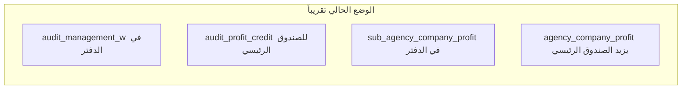
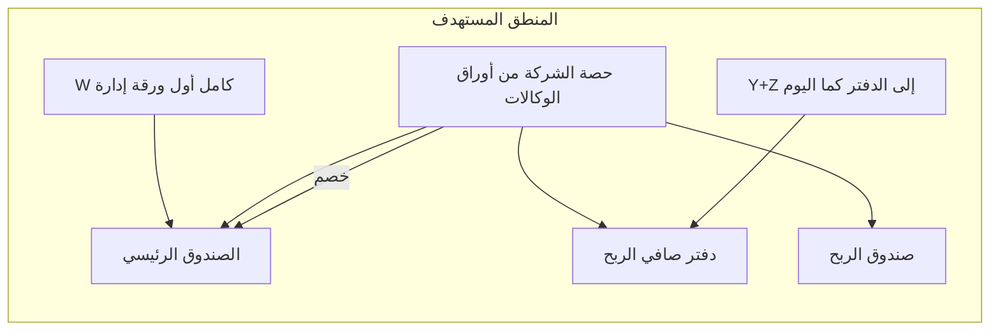

# خطة: صندوق الربح، منطق W/الوكالات، و«ديين لنا»

## الوضع الحالي (المشكلة)

- في `[services/cycleAccountingService.js](services/cycleAccountingService.js)` الدالة `applyCycleAuditProfitsToLedger`:
  - تسجّل قيدين في **صافي الربح**: `audit_management_yz` (Y+Z) و `audit_management_w` (حصة W بعد تقسيم أول ورقة حسب ربط المستخدم بوكالة).
  - وتضيف للصندوق الرئيسي حركة `audit_profit_credit` بمبلغ `combined = sourceFirstSheetW + sourceYZ`.
- في `[services/agencySyncService.js](services/agencySyncService.js)` الدالة `recalculateSyncProfitsForCycle`:
  - تحسب حصة الشركة من **أوراق الوكالات الفرعية** وتسجّل `sub_agency_company_profit` في الدفتر، **وتضيف** لنفس المبلغ حركة `agency_company_profit` على **الصندوق الرئيسي** (إيداع).

هذا يفسّر ازدواجية المفهوم: ظهور «أرباح الإدارة: عمود W» في مصادر الربح مع «ربح الشركة من نسبة الوكالات»، وعدم تطابق منطقك: **W كامل في الصندوق الرئيسي أولاً** ثم **خصم حصة الشركة من الصندوق الرئيسي** واعتبارها ربحاً (وليس إيداعاً إضافياً لنفس الحصة على الصندوق الرئيسي).

## المنطق المستهدف (حسب طلبك)

1. **لا قيد منفصل باسم «أرباح الإدارة: عمود W»** (`audit_management_w`) في دفتر صافي الربح.
2. **إيداع عمود W كاملاً** (من ورقة الإدارة الأولى: مجموع قيم عمود W كما في الجدول، دون تقسيم شركة/وكالة في خطوة الإيداع الأولى) **في الصندوق الرئيسي** ضمن تدقيق الدورة، مع الإبقاء على **Y+Z** كما هو منفصلاً (`audit_management_yz`) إن رغبت بذلك (لم تطلب حذف Y+Z).
3. عند تطبيق نسب الوكالات (`recalculateSyncProfitsForCycle`): **خصم** مجموع «ربح الشركة من نسبة الوكالات» من **الصندوق الرئيسي**، وتسجيل نفس المبلغ كربح في **صافي الربح** (الدفتر) و/أو ترحيله إلى **صندوق الربح** الفعلي.
4. **صندوق الربح**: صندوق فعلي في `[funds](db/schema.pg.sql)` / `[fund_balances](db/schema.pg.sql)`، لكن **لا يُحسب ضمن بطاقة «رصيد الصندوق»** في اللوحة؛ يظهر أثر الربح في **بطاقة/إجمالي الربح الصافي** (ومصادر الربح حسب التصميم).
5. **قسم جديد «ديين لنا»**: بطاقة/صفحة تعرض تجميعاً لكل ما **لنا** (أرصدة موجبة): معتمدين، شركات تحويل، صناديق، وكالات، وأي مصادر أخرى متسقة مع البيانات الحالية.

*(الرسم مبسّط؛ التفصيل التنفيذي: حركة واحدة خصم من الرئيسي + إيداع في صندوق الربح + قيد net_profit لتجنب ازدواجية المحاسبة — يُحدَّد في التنفيذ بدقة حسب قرارك: إما ترحيل نقدي لصندوق الربح فقط، أو قيد دفتر + صندوق بدون تكرار.)*

## تغييرات تقنية مقترحة

### أ) `[services/cycleAccountingService.js](services/cycleAccountingService.js)`

- إزالة إدراج `audit_management_w` (السطور ~142–151).
- توسيع `computeManagementSheetTotalsFromRows` (أو دالة مساعدة) لإرجاع:
  - `**sumW_raw`**: مجموع عمود W لجميع صفوف البيانات في ورقة الإدارة الأولى (بدون تقسيم شركة/وكالة).
  - الإبقاء على `**sourceYZ`** كما هو.
  - استخدام `**sumW_raw + sourceYZ`** لحركة `audit_profit_credit` على الصندوق الرئيسي بدل `combined` الحالي، أو تعديل التعليقات/المنطق ليتوافق مع «W كامل».
- **الترحيل/التوافق**: القيود القديمة `audit_management_w` يمكن إخفاؤها من تقرير «مصادر الربح» أو دمجها عرضياً مع `sub_agency_company_profit` (حسب رغبتك؛ الحد الأدنى: إيقاف القيد الجديد + إبقاء القديم للتاريخ).

### ب) `[services/agencySyncService.js](services/agencySyncService.js)` — `recalculateSyncProfitsForCycle`

- استبدال `**adjustFundBalance` الإيجابي** من نوع `agency_company_profit` على الصندوق الرئيسي بـ:
  - `**debitFundBalance`** أو `adjustFundBalance` بقيمة سالبة على الصندوق الرئيسي بمبلغ `totalCompanyProfit` (مع منع التكرار بنفس `ref`/`notes` للدورة).
  - إيداع **نفس المبلغ** في **صندوق الربح** (الحصول على `fund_id` لصندوق الربح — انظر أدناه).
- الإبقاء على `insertLedgerEntry` لـ `sub_agency_company_profit` في `net_profit` إذا كان يمثل «ظهور الربح في صافي الربح» — أو توحيد المصدر مع حركة صندوق الربح لتجنب تكرار الرقم في لوحة الربح (قرار محاسبي دقيق في التنفيذ).

### ج) صندوق الربح الفعلي

- **مخطط قاعدة البيانات**: إضافة عمود على `funds` مثل `exclude_from_dashboard INTEGER DEFAULT 0` أو `is_profit_pool INTEGER DEFAULT 0` (مع تعليق في المخطط).
- في `[services/fundService.js](services/fundService.js)`: `ensureDefaultProfitFund` أو توسيع `ensureDefaultMainFund` لإنشاء صندوق باسم `صندوق الربح` مرة واحدة لكل مستخدم، مع `exclude_from_dashboard = 1`.
- في `[routes/dashboard.js](routes/dashboard.js)` (وأي تجميع `fundTotals`/`fundUsdAll` للوحة): **استبعاد** الصناديق ذات `exclude_from_dashboard` من بطاقة رصيد الصندوق والعروض المشابهة.
- **إجمالي الربح الصافي** (`netProfit`): يجب أن يتضمن **أثر** صندوق الربح أو يبقى على `ledger` فقط — يُحدَّد في التنفيذ بدون ازدواجية.

### د) قسم «ديين لنا»

- إضافة دالة تجميع جديدة في `[services/debtAggregation.js](services/debtAggregation.js)` (أو ملف جديد `receivablesAggregation.js`):  
`computeReceivablesToUs(db, userId)` تجمع:
  - معتمدين: `balance_amount > 0` من `accreditation_entities`.
  - شركات تحويل: `balance_amount > 0` من `transfer_companies`.
  - صناديق: أرصدة USD موجبة من `fund_balances` + `funds` (مع استبعاد صندوق الربح إن لزم).
  - وكالات فرعية: منطق الرصيد الموجب من `sub_agency_transactions` (نفس فكرة `[calculateAgencyBalance](routes/subAgencies.js)` لكن فلترة `> 0` وتجميع).
- إرجاع **إجمالي** + **تفصيل اختياري** للواجهة.
- مسار API: مثلاً `GET /dashboard/receivables-to-us` أو `GET /api/debts/to-us` مع `requireAuth`.
- واجهة: صفحة جديدة أو جزء في `[views/partials/dashboard.ejs](views/dashboard.ejs)` / رابط جانبي، مع بطاقة تعرض الإجمالي وجدول/روابط للتفاصيل (مشابهة لـ `[views/partials/debts.ejs](views/partials/debts.ejs)`).

### هـ) `[public/js/profit-sources.js](public/js/profit-sources.js)`

- إزالة أو إبقاء تسمية `audit_management_w` للأرشيف؛ إيقاف إنشاء قيود جديدة يكفي لاختفاء السطر مستقبلاً.

## مخاطر واختبارات

- **تداخل** بين `audit_profit_credit` (W كامل + Y+Z) و **لقطة الصندوق** `[cash_box_snapshot](services/agencySyncService.js)` — قد تحتاج مراجعة `calculateCashBoxBalance` لتفادي ازدواج عرض في التقارير (خارج نطاق هذه البطاقة إن كانت اللقطة «مرجعاً» فقط).
- **اختبار يدوي**: دورة واحدة بعد النشر — تدقيق رواتب → التحقق من مصدر الربح (لا `audit_management_w`)، حركة خصم صحيحة على الصندوق الرئيسي، رصيد صندوق الربح، وبطاقة «ديين لنا».

## تقدير حجم العمل

- **متوسط إلى كبير**: تغيير في مسار محاسبي حرج + عمود جديد + صفحة/بطاقة جديدة + تعديلات لوحة التحكم.

