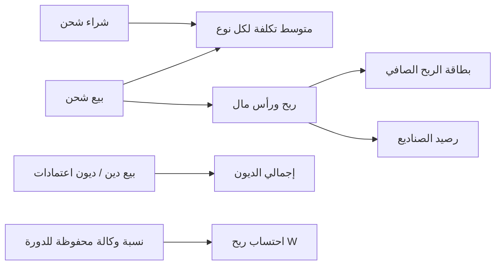

# خطة تطوير منطق الشحن، الصناديع، والوكالات

## الوضع الحالي (مرجع)

- الشراء/البيع في `[routes/shipping.js](routes/shipping.js)` يحسب `total = quantity * unitPrice` بينما المطلوب: **المبلغ المدخل = إجمالي قيمة تلك الكمية** (تأكيدك).
- بطاقات **إجمالي الإيرادات / الربح الصافي / إجمالي الديون** في `[views/partials/home.ejs](views/partials/home.ejs)` موجودة لكن **لا تُحدَّث** في `[public/js/app.js](public/js/app.js)` — بينما `[/dashboard/stats](routes/dashboard.js)` يعيد فقط `cashBalance` (من `cash_box_snapshot`)، `deferredBalance`، و`shippingBalance` ككمية ذهب/كرستال.
- مزامنة الوكالات في `[services/agencySyncService.js](services/agencySyncService.js)`: تقرأ عمود **W** وتُدخل أرباحاً في `sub_agency_transactions` فوراً باستخدام `commission_percent` الحالي من `[shipping_sub_agencies](db/schema.pg.sql)`.
- `[views/partials/transfer-companies.ejs](views/partials/transfer-companies.ejs)` و`[views/partials/approvals.ejs](views/partials/approvals.ejs)` **placeholder** فقط.

---

## 1) منطق الشحن (شراء / بيع / لوحة التحكم)

**النموذج المحاسبي (متوسط مرجح لكل نوع سلعة):**

- عند **الشراء**: لكل `item_type` (ذهب/كرستال) تحديث:  
`new_avg_cost_per_unit = (prev_qty * prev_avg + purchase_total_amount) / (prev_qty + purchase_qty)`.
- عند **البيع**:  
`cost_of_goods = sell_qty * avg_cost_per_unit` (رأس المال المسترد للعملية)،  
`revenue = sell_total_amount` (المبلغ الإجمالي للسطر)،  
`profit = revenue - cost_of_goods` (يذهب لبطاقة **الربح الصافي**)،  
`cost_of_goods` يُعرض كـ **رصيد/رأس مال** في سياقك ضمن **رصيد الصندوق** عند اكتمال التحصيل (انظر دمج الصناديع أدناه).

**قاعدة البيانات:** إما توسيع `[shipping_transactions](db/schema.pg.sql)` بحقول صريحة (`line_total_amount`, `cost_basis_allocated`, `profit_amount`, `capital_amount`) أو الاحتفاظ بـ `total` كـ «إجمالي المبلغ للسطر» وإزالة ضرب الكمية في السعر في الكود، مع جدول صغير `shipping_inventory_avg` (`user_id` أو عام، `item_type`, `qty_on_hand`, `avg_cost_per_unit`) لتحديث المتوسط بعد كل عملية.

**الديون:** إن `payment_method === 'debt'` (أو ما يعادله)، يُضاف المبلغ المناسب إلى **إجمالي الديون** (إيراد معلق أو ذمة)، مع تفصيل عند النقر.

**جميع أنواع المشترين:** تطبيق نفس توزيع الربح/رأس المال لكل `buyer_type` عند البيع النقدي/المكتمل؛ مسار الوكيل الفرعي الحالي في `[registerShippingForAgency](routes/subAgencies.js)` يُوسَّع أو يُوازَن حتى لا يُضاعَف الربح.

---

## 2) تبويب «وكالات الشحن» داخل صفحة الشحن

- واجهة: تبويب جديد في `[views/partials/shipping.ejs](views/partials/shipping.ejs)` + منطق في `[public/js/shipping.js](public/js/shipping.js)`.
- جداول مقترحة: `shipping_carrier_agencies` (اسم، بيانات تعريف)، `shipping_carrier_balances` (كمية/مبلغ حسب تعريفك)، `shipping_carrier_transactions` (وارد/صادر، مرجع لعملية شحن إن وُجدت).
- **إضافة وكالة:** نموذج: الاسم، المبلغ، الكمية — بعد الحفظ تظهر كبطاقة؛ عند الفتح: سجل وارد/صادر بتصميم جدول/خط زمني.
- **البيع عبر وكالة شحن:** إضافة `buyer_type` جديد (مثلاً `shipping_carrier`) في نموذج البيع وربطه بـ `carrier_agency_id`، ومعالجة نفس توزيع الربح/الرأسمال كأعلاه.

---

## 3) الوكالات الفرعية: نسبة محفوظة لكل دورة + المزامنة

**المشكلة:** الربح من عمود W يُحسب فوراً بنسبة الوكالة الحالية؛ المطلوب **عدم الاعتماد على W للعرض حتى «حفظ» النسبة**، مع **نسخة نسبة لكل دورة مالية** ولسيناريوهات تدقيق قديم.

**مقترح مخطط:**

- جدول `sub_agency_cycle_settings` (`cycle_id`, `sub_agency_id`, `commission_percent`, `company_percent`, `saved_at`) — يُملأ عند الضغط على **حفظ** بجانب نسبة الوكالة في واجهة `[partials/sub-agencies](views/partials/sub-agencies.ejs)`.
- عند **المزامنة** (`[syncAgenciesFromManagementTable](services/agencySyncService.js)`):  
  - تحديث/إدراج `agency_cycle_users` و`base_profit_w` من الورقة.  
  - **لا** إنشاء `sub_agency_transactions` من نوع `profit` من W إلا إذا وُجدت نسبة محفوظة لتلك `(cycle_id, sub_agency_id)`، أو احتساب الربح باستخدام النسبة المحفوظة لتلك الدورة فقط.  
  - عند **تدقيق مستخدم من دورة قديمة**: جلب النسبة من `sub_agency_cycle_settings` لتلك الدورة (وليس النسبة الحالية في `shipping_sub_agencies`).
- **دورة جديدة بنسبة جديدة:** تُطبَّق على المعاملات/الحسابات المرتبطة بتلك الدورة فقط.
- **أوراق جديدة من جدول الإدارة:** إنشاء وكالات/صفوف جديدة **بدون حذف** وكالات فرعية قائمة — المزامنة الحالية تفعل `INSERT` للوكالة بالاسم؛ يجب التأكد من عدم وجود `DELETE` على الوكالات عند المزامنة (مراجعة `[cycleSyncWorker](services/cycleSyncWorker.js)` إن وُجد).

**واجهة:** زر **حفظ** بجانب حقل نسبة الوكالة في بطاقة كل وكالة؛ استدعاء API يحدّث `sub_agency_cycle_settings` للدورة المختارة ويعيد احتساب أرباح تلك الدورة من بيانات W إن لزم.

---

## 4) لوحة التحكم: بطاقات قابلة للنقر + «رصيد الصندوق» و«رأس المال»

- توسيع `[GET /dashboard/stats](routes/dashboard.js)` لإرجاع: `totalRevenue`, `netProfit`, `totalDebts` (من تجميع عمليات الشحن + الصناديع/الاعتمادات لاحقاً)، وفصل **صافي الربح** عن **رأس المال المسترد** إن رغبت ببطاقة مستقلة (يمكن إضافة بطاقة «رأس المال» أو دمج العرض حسب التصميم).
- تحديث `[initHomeStats](public/js/app.js)` لتعبئة `#totalRevenue`, `#netProfit`, `#totalDebts`.
- **عند النقر على رصيد الصندوق:** مسار جديد (مثلاً `/dashboard/fund-sources` modal أو صفحة جزئية) يعرض **مصادر الأموال** + قائمة الصناديع وأرصدتها (بعد تنفيذ قسم الصناديع).
- **بطاقة رأس المال (أو قسم داخل الصندوق):** واجهة **ترحيل الأرباح إلى صندوق**: اختيار صندوق، ودعم **دفعات متعددة** (جدول `profit_transfer_batches`: صندوق، مبلغ، تاريخ، مرجع دورة).

**ملاحظة:** طلبت **الاثنتين** لبطاقة المجموع: عرض **مجموع أرصدة الصناديع** (مع التعامل متعدد العملات: عرض لكل عملة أو تحويل لعملة أساسية من الإعدادات) **و** إبراز **الصندوق الرئيسي** القابل للتعيين من ملف الصندوق.

---

## 5) نظام الصناديع (قائمة جانبية + صفحة جديدة)

- إضافة مسار في `[routes/pages.js](routes/pages.js)` و`include` في `[dashboard.ejs](views/dashboard.ejs)` + رابط في الشريط الجانبي.
- جداول مقترحة: `funds` (اسم، رقم صندوق، `transfer_company_id` اختياري، دولة، محافظة إن سوريا، `is_main`, مراجعات)، `fund_balances` (`fund_id`, `currency`, `amount`), `fund_ledger` (جميع الحركات)، `fund_transfers` (من صندوق إلى صندوق).
- **نموذج إضافة صندوق:** اسم + رقم + قائمة شركات التحويل (من الجدول الجديد أو الموسّع) + دولة (قائمة عربية مع ترتيب الأولوية الذي ذكرتَه + محافظات سوريا عند اختيار سوريا) + **رصيد مرجعي** واختياري **رصيد مرجعي بعملة أخرى** (عدة صفوف في `fund_balances`).
- **ملف الصندوق:** عرض الرصيد متعدد العملات، الرقم، الاسم، الدولة، السجل، **ترحيل إلى صندوق آخر**، **تعيين كصندوق رئيسي**.
- **لوحة التحكم:** ربط `cashBalance` بمجموع الصناديع (و/أو الصندوق الرئيسي حسب الإعداد).

---

## 6) شركات التحويل (إعادة تصميم الصفحة الحالية)

- استبدال الـ placeholder في `[transfer-companies.ejs](views/partials/transfer-companies.ejs)` بنمط بطاقات مثل الصناديع.
- جدول `transfer_companies` موسّع: اسم، دولة (نفس منطق الصناديع)، رصيد (موجب = لنا / سالب = علينا) + عملة، أنواع التحويل (جدول فرعي أو JSON للقيم: شام كاش، هرم، … مع دعم تعدد الاختيار).
- ملف الشركة: سجل العمليات فقط (أو مرتبط بحركات الصناديع لاحقاً).

---

## 7) الاعتمادات (صفحة القائمة الحالية)

- استبدال placeholder في `[approvals.ejs](views/partials/approvals.ejs)`.
- كيان منفصل عن `[shipping_approved](db/schema.pg.sql)` إن لزم: `accreditations` (اسم، كود)، `accreditation_ledger`.
- **إضافة مبلغ:** راتب (لنا/علينا)، نسبة وساطة (تخصم وتظهر في الربح الصافي، الباقي يذهب لمنطق رصيد الصندوق)، ربط بدورة مالية.
- **تحويل:** قائمة: تسليم يدوي / تحويل صندوق / تحويل (شركة) / شحن — كل مسار يفتح اختيار الصندوق أو شركة التحويل أو واجهة الشحن.
- **دين المعتمد:** إذا الرصيد ≤ 0 وتم «تحويل له»، يُسجَّل كدين ويظهر في **إجمالي الديون**؛ النقر يعرض السجل (لنا/عليه).
- **تثبيت:** حقل `pinned` أو ترتيب يدوي لإبقاء ملف في الأعلى.

---

## تدفق البيانات (مبسّط)

---

## ترتيب التنفيذ المقترح (لتقليل التعارض)

1. مخطط قاعدة البيانات + تعديلات الشحن (متوسط التكلفة + حقول المبلغ الإجمالي) + ربط لوحة التحكم بالأرقام الأساسية.
2. الوكالات الفرعية: `sub_agency_cycle_settings` + تعديل المزامنة + زر الحفظ في الواجهة.
3. الصناديع الأساسية ثم ربط بطاقة رصيد الصندوق بالمجموع + الصندوق الرئيسي.
4. تبويب وكالات الشحن + نوع مشترٍ جديد.
5. شركات التحويل الموسّعة ثم اعتمادات كاملة مع مسارات التحويل.
6. نوافذ التفصيل (نقر البطاقات) والترحيل متعدد الدفعات.

---

## ملفات سيُمسّها هذا العمل بشكل أساسي

- `[routes/shipping.js](routes/shipping.js)`، `[public/js/shipping.js](public/js/shipping.js)`، `[views/partials/shipping.ejs](views/partials/shipping.ejs)`
- `[routes/dashboard.js](routes/dashboard.js)`، `[views/partials/home.ejs](views/partials/home.ejs)`، `[public/js/app.js](public/js/app.js)`
- `[services/agencySyncService.js](services/agencySyncService.js)`، `[routes/subAgencies.js](routes/subAgencies.js)`، `[views/partials/sub-agencies.ejs](views/partials/sub-agencies.ejs)`
- `[db/schema.pg.sql](db/schema.pg.sql)` + ترحيلات إن وُجدت في المشروع
- `[routes/pages.js](routes/pages.js)`، `[views/dashboard.ejs](views/dashboard.ejs)` — لصفحة الصناديع الجديدة
- `[views/partials/transfer-companies.ejs](views/partials/transfer-companies.ejs)`، `[views/partials/approvals.ejs](views/partials/approvals.ejs)`

