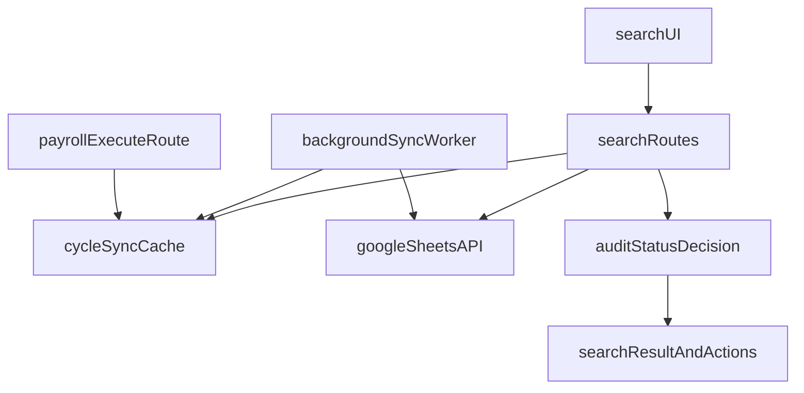

# خطة إضافة قسم البحث

## الهدف

إضافة قسم جديد باسم `البحث` يعمل من السيرفر ويعطي حالة المستخدم عبر كل الدورات، مع تنفيذ تدقيق انتقائي من نفس القسم عند عدم التدقيق، دون كسر نظام `تدقيق الرواتب` الحالي.

## معمارية التنفيذ

## نطاق التغيير

- **إضافة صفحة/قسم جديد** بدل زر الإعدادات في موبايل، مع ملفات جديدة.
- **إضافة APIs جديدة للبحث والتنفيذ الانتقائي** منفصلة عن مسار `payroll-execute` الحالي.
- **إضافة جداول كاش/فهرسة** لحفظ آخر مزامنة وحالة التدقيق اليدوي.
- **إضافة مزامنة خلفية دورية** لكل الدورات المرتبطة.
- **ربط فوري** بعد أي تنفيذ تدقيق من النظام لتحديث الكاش مباشرة.

## الملفات الأساسية المتأثرة

- واجهة التوجيه والعرض:
  - [c:/Users/ALALMIA/Documents/GitHub/ERPSYSTEM-/routes/pages.js](c:/Users/ALALMIA/Documents/GitHub/ERPSYSTEM-/routes/pages.js)
  - [c:/Users/ALALMIA/Documents/GitHub/ERPSYSTEM-/views/dashboard.ejs](c:/Users/ALALMIA/Documents/GitHub/ERPSYSTEM-/views/dashboard.ejs)
- باكند تدقيق الرواتب الحالي (للربط فقط بدون كسر المنطق):
  - [c:/Users/ALALMIA/Documents/GitHub/ERPSYSTEM-/routes/sheet.js](c:/Users/ALALMIA/Documents/GitHub/ERPSYSTEM-/routes/sheet.js)
- قاعدة البيانات:
  - [c:/Users/ALALMIA/Documents/GitHub/ERPSYSTEM-/db/database.js](c:/Users/ALALMIA/Documents/GitHub/ERPSYSTEM-/db/database.js)
- ملفات جديدة مقترحة:
  - `c:/Users/ALALMIA/Documents/GitHub/ERPSYSTEM-/routes/search.js`
  - `c:/Users/ALALMIA/Documents/GitHub/ERPSYSTEM-/services/payrollSearchService.js`
  - `c:/Users/ALALMIA/Documents/GitHub/ERPSYSTEM-/services/cycleSyncWorker.js`
  - `c:/Users/ALALMIA/Documents/GitHub/ERPSYSTEM-/views/partials/search.ejs`

## منطق البحث المطلوب

- إدخال: دورة مالية + رقم مستخدم + نسبة خصم.
- مخرجات مباشرة:
  - الاسم
  - الراتب قبل الخصم
  - الراتب بعد الخصم
  - الحالة: `سحب وكيل` / `سحب ادارة` / `غير موجود`
- إن كان مدققًا مسبقًا: إظهار نفس البيانات + إشعار `مدقق` مع مصدره:
  - `مدقق وكيل يدوي`
  - `مدقق إدارة يدوي`
  - `مدقق يدوي (الاثنان)`
- إن لم يكن مدققًا: إظهار خيارات التنفيذ:
  - قائمة الدورات غير المدقق بها
  - قائمة أوراق جدول الإدارة في الدورة المختارة
  - خيار إنشاء ورقة جديدة
  - ألوان الوكيل/الإدارة
  - نسبة الخصم
  - زر تنفيذ

## معيار "مدقق يدوي" (وفق اختيارك: الوجود + اللون)

- في كل دورة:
  - نتحقق هل رقم المستخدم موجود في الأوراق الهدف داخل جدول الإدارة.
  - ونقرأ تلوين الصف في ورقة الوكيل/الإدارة الرئيسية.
- نصنّف الحالة اليدوية كالتالي:
  - وجود + لون وكيل فقط => `مدقق وكيل يدوي`
  - وجود + لون إدارة فقط => `مدقق ادارة يدوي`
  - وجود + اللونين => `مدقق يدوي`

## استراتيجية المزامنة (Background Polling)

- عند بدء السيرفر: تشغيل Worker دوري (مثلاً كل 60-120 ثانية).
- الـ Worker يمر على كل الدورات المرتبطة بـ Google:
  - يجلب الإدارة + الوكيل + بيانات الأوراق الهدف المطلوبة للتحقق.
  - يحدث الكاش بآخر نسخة + وقت مزامنة + بصمة تغيير.
- البحث يعتمد على الكاش مباشرة لتقليل طلبات Google.
- عند تنفيذ تدقيق من النظام (من قسم الرواتب أو البحث): تحديث كاش الدورة فورًا داخل نفس الطلب.

## ضمان عدم تعطيل نظام الرواتب الحالي

- عدم تعديل منطق القرار الأساسي داخل `payroll-execute` إلا بإضافة Hook تحديث كاش بعد النجاح.
- إبقاء واجهة `payroll.ejs` الحالية بدون كسر.
- APIs الجديدة تعمل في مسار مستقل (`/api/search/...`) وتعتمد نفس تطبيع رقم المستخدم.

## ترتيب التنفيذ

1. إضافة جداول كاش جديدة في DB (حالة مزامنة الدورة + حالة تدقيق المستخدم لكل دورة).
2. بناء `payrollSearchService` (تطبيع رقم المستخدم، القراءة من الكاش، التصنيف، الحساب قبل/بعد الخصم).
3. بناء `cycleSyncWorker` للمزامنة الدورية وربطه مع السيرفر عند الإقلاع.
4. إضافة `routes/search.js`:
  - جلب الدورات
  - بحث رقم مستخدم
  - تنفيذ تدقيق انتقائي لمستخدم واحد عند الحاجة
5. إضافة `views/partials/search.ejs` وربطه في `dashboard.ejs`.
6. استبدال زر الإعدادات في Mobile Bottom Nav بزر `البحث` (مع إبقاء صفحة الإعدادات متاحة من القائمة الجانبية).
7. ربط `payroll-execute` بتحديث كاش فوري عند النجاح.
8. اختبارات تكامل: بحث قبل/بعد التدقيق، تدقيق يدوي في Google ثم انعكاس الحالة، ومنع النسخ المكرر.

## ملاحظة تقنية مهمة

- سنوحّد دوال التطبيع (`normalizeForNumber` / `normalizeUserId`) في خدمة مشتركة لتطابق نتائج البحث مع نتائج تدقيق الرواتب حرفيًا عبر جميع الدورات.

