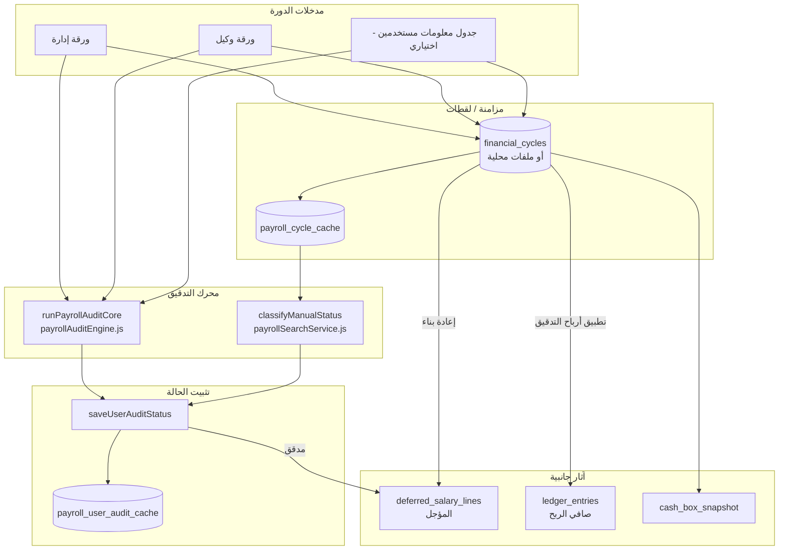
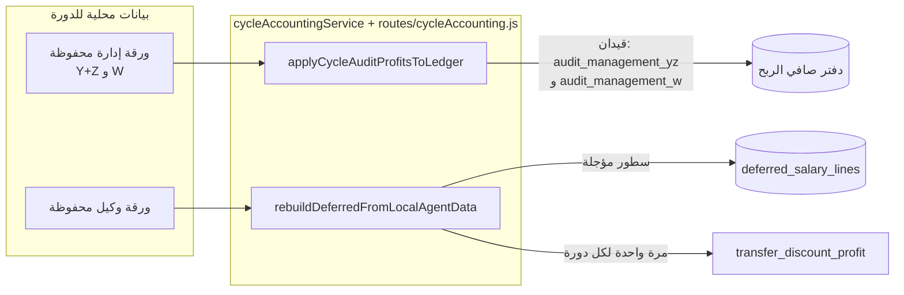
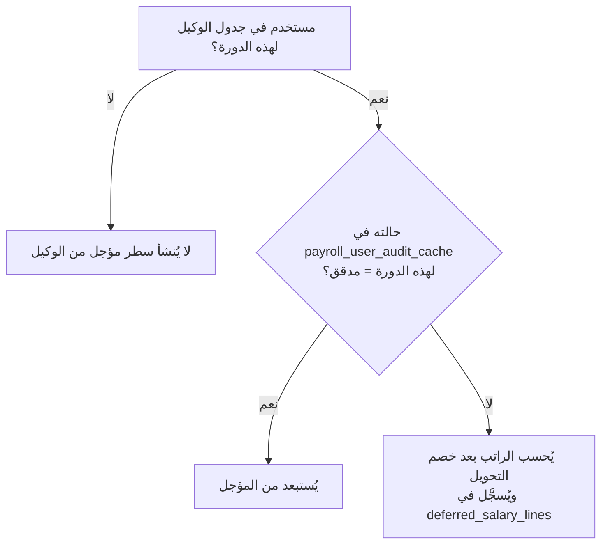
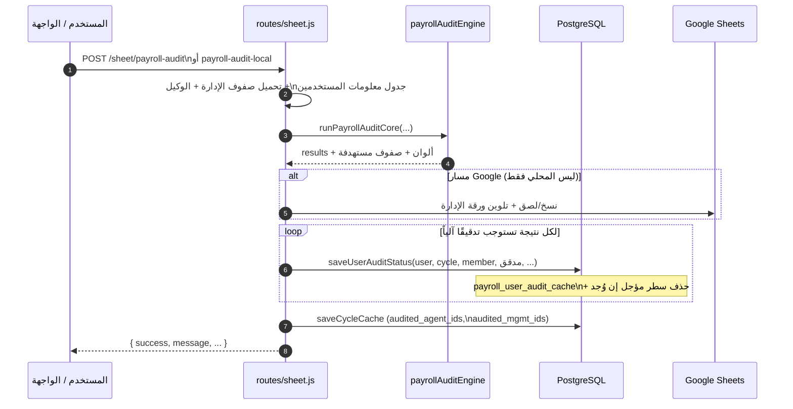
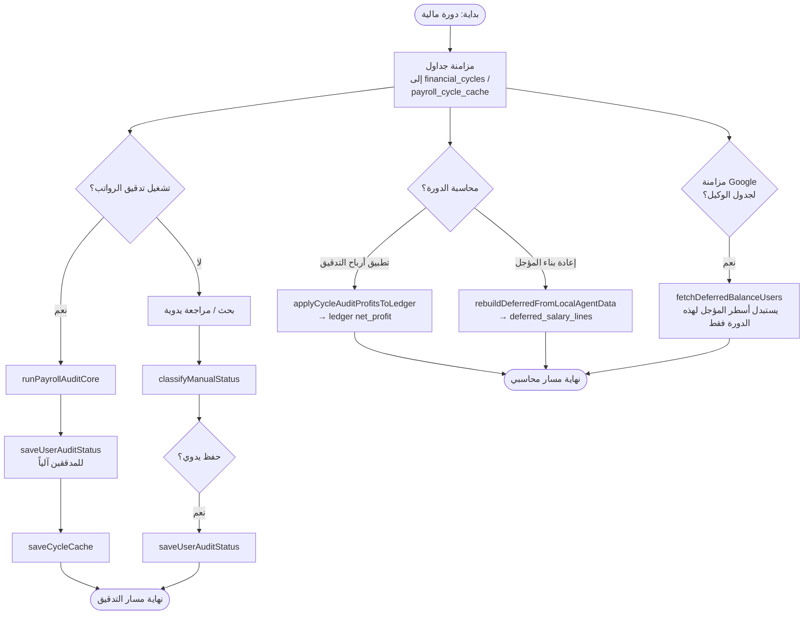
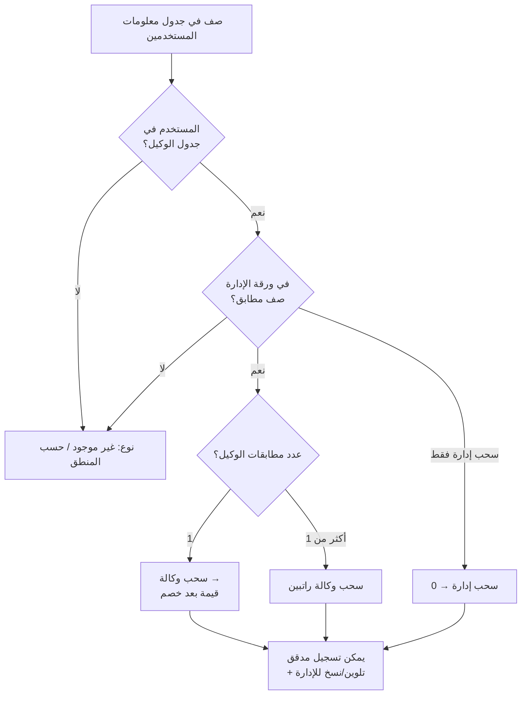
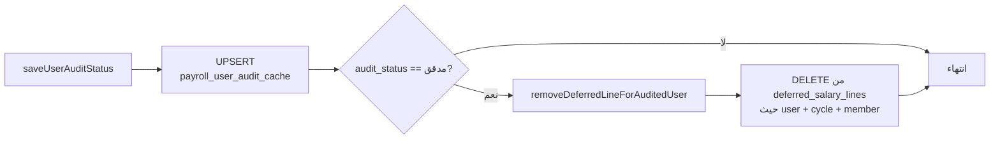
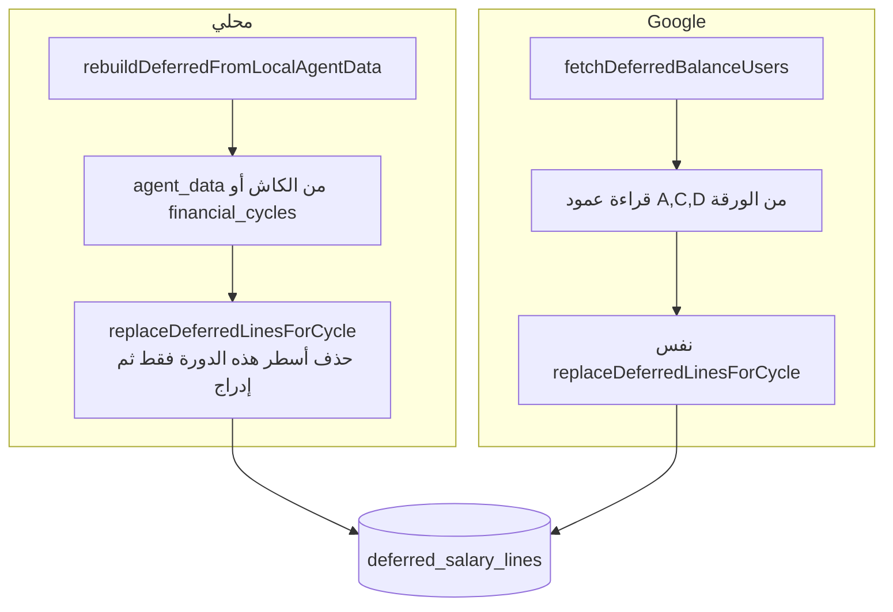

# خريطة التدقيق والمنطق (نظام الرواتب والدورات المالية)

**مرتبط بـ:** [علاقات-وتدفق-التدقيق.md](./علاقات-وتدفق-التدقيق.md) — مخطط **Relations (ER)** + **Flow** مرتكز على الجداول.

هذا المستند يصف **منطق التدقيق** كما هو مطبّق في المشروع: من الجداول والذاكرة المؤقتة إلى تسجيل «مدقق / غير مدقق»، ثم الأثر على **صافي الربح** و**المؤجل** و**لقطة الصندوق**.

---

## 1. مصطلحات سريعة

| المصطلح | المعنى في النظام |
|--------|-------------------|
| **دورة مالية** | سجل `financial_cycles` مرتبط بجداول إدارة / وكيل (ومعلومات مستخدمين اختياريًا). |
| **تدقيق مستخدم (عضو)** | معرف المستخدم في الجداول (`member_user_id`) أصبح **مدققًا** في *هذه الدورة* أو لا. |
| **ورقة إدارة** | جدول يحتوي أعمدة منها W و Y و Z (وغيرها حسب الإعداد). |
| **ورقة وكيل** | جدول رواتب/مبالغ للوكيل؛ يُطبَّق عليه **نسبة خصم التحويل** عند حساب المؤجل وربح الخصم. |
| **لقطة كاش للبحث** | `payroll_cycle_cache` — نسخ محلية من الصفوف + أعلام تلوين (وكيل/إدارة) لاستخدام البحث والتدقيق اليدوي. |

---

## 2. أين تُخزَّن حالة التدقيق؟

```text
payroll_user_audit_cache
  (user_id, cycle_id, member_user_id) → audit_status, audit_source, details_json
```

- **مفتاح فريد:** مستخدم النظام + الدورة + رقم المستخدم في الجداول.
- القيم الشائعة لـ `audit_status`: **`مدقق`** أو **`غير مدقق`** (وقد تُدمج مع مصادر أخرى في واجهة البحث).

**ذاكرة مساعدة للواجهة (تلوين الصفوف في الكاش):**

- `payroll_cycle_cache.audited_agent_ids` — مَن عُرّف كتدقيق من جهة **الوكيل** (مجموعة معرفات).
- `payroll_cycle_cache.audited_mgmt_ids` — مَن عُرّف كتدقيق من جهة **الإدارة**.

هذه المجموعات تُستخدم مع **منطق التصنيف اليدوي** (انظر القسم 4).

---

## 3. خريطة التدفق العامة (من البيانات إلى القرار)



---

## 4. منطق «مدقق / غير مدقق» — مساران

### أ) تلقائي من تنفيذ التدقيق على السيرفر (`runPayrollAuditCore`)

الملف: `services/payrollAuditEngine.js` — يُستدعى من:

- `POST /sheet/payroll-audit` (مع Google: نسخ/تلوين على الإدارة إن وُجدت صلاحية)، و
- `POST /sheet/payroll-audit-local` (تشغيل منطقي محلي دون كتابة على Google).

لكل صف في **جدول معلومات المستخدمين** يُحسب:

- هل المستخدم في **الوكيل** و**الإدارة**؟
- النتيجة تُصنَّف تقريبًا إلى: **سحب وكالة**، **سحب وكالة راتبين**، **سحب إدارة**، **غير موجود**، إلخ.
- عند وجود سحب وكالة أو سحب إدارة مع صف إدارة مطابق، يُمكن تسجيل المستخدم كـ **`مدقق`** في `payroll_user_audit_cache` مع مصدر مثل «تدقيق وكيل من النظام» أو «تدقيق ادارة من النظام» (`routes/sheet.js`).

**الخلاصة:** التدقيق الآلي يملأ الكاش والـ `audited_*` ثم يستدعي `saveUserAuditStatus(..., 'مدقق', ...)`.

### ب) يدوي من البحث / ألوان الجداول (`classifyManualStatus`)

الملف: `services/payrollSearchService.js`

يُستخدم عندما لا يوجد سجل صريح في `payroll_user_audit_cache` أو لدمج مع الوضع المرئي:

| في الإدارة؟ | في الوكيل؟ | تلوين وكيل؟ | تلوين إدارة؟ | النتيجة |
|-------------|------------|-------------|--------------|---------|
| لا | لا | — | — | غير مدقق |
| نعم أو نعم | — | لا ولون الإدارة لا | لا | غير مدقق |
| نعم | — | نعم، الإدارة لا | — | مدقق (وكيل يدوي) |
| نعم | — | لا، الإدارة نعم | — | مدقق (إدارة يدوي) |
| — | — | نعم ونعم | — | مدقق يدوي |

**الفكرة:** التلوين في الكاش يمثّل «تمت معالجة الصف» من جهة الوكيل أو الإدارة؛ بدون أي تلوين يبقى **غير مدقق**.

---

## 5. المحاسبة المرتبطة بالتدقيق (ليس مجرد وسوم)

هذه الخطوات **لا تستبدل** تسجيل «مدقق» في الكاش، لكنها تربط **أرقام الإدارة/الوكيل** بالدفتر المحاسبي.



### أ) تسجيل أرباح التدقيق من الإدارة — `applyCycleAuditProfitsToLedger`

- **مصدر البيانات:** صفوف **ورقة الإدارة** المحفوظة للدورة (`payroll_cycle_cache` أو `financial_cycles.management_data`).
- **Y + Z:** يُجمعان في قيد **`audit_management_yz`** (دلو `net_profit`).
- **W:** يُحسب مع منطق **الوكالة الفرعية**: إذا كان المستخدم مربوطًا بوكالة، يُؤخذ من W **حصة الشركة** فقط (`company_percent`)؛ وإلا **W كاملًا** — قيد **`audit_management_w`**.
- **منع التكرار:** إن وُجد قيد قديم `audit_cycle_profits` أو القيدان الجديدان، لا يُعاد التسجيل لنفس الدورة.

**المسار:** `POST /cycle-accounting/apply-audit-profits/:cycleId`

### ب) المؤجل وربح خصم التحويل — `rebuildDeferredFromLocalAgentData`

- **جدول الوكيل** + **`transfer_discount_pct`** للدورة.
- لكل صف: **قبل وبعد الخصم**؛ مجموع الفرق = **`transfer_discount_profit`** (مرة واحدة لكل دورة إن لم يُسجَّل).
- **غير المدققين** في هذه الدورة (`payroll_user_audit_cache` ≠ مدقق): يُنشَأ/يُحدَّث سطر في **`deferred_salary_lines`** لهذه الدورة فقط.
- **المدققون:** لا يُدرجون في المؤجل لهذه الدورة.

**المسار:** `POST /cycle-accounting/rebuild-deferred/:cycleId`

### ج) مزامنة Google للمؤجل

- `fetchDeferredBalanceUsers` يقرأ عمود الوكيل من Google ويطبّق نفس خصم التحويل ويستبدل أسطر **`deferred_salary_lines`** لتلك الدورة فقط (`agencySyncService.js`).

---

## 6. ماذا يحدث عند `saveUserAuditStatus(..., 'مدقق')`؟

1. تحديث **`payroll_user_audit_cache`**.
2. **حذف** سطر المؤجل المقابل في **`deferred_salary_lines`** لنفس `(user_id, cycle_id, member_user_id)` (`deferredSalaryService.removeDeferredLineForAuditedUser`).

بهذا يرتبط «التدقيق» بـ **إزالة الرصيد المؤجل لتلك الدورة** لذلك المستخدم.

---

## 7) دمج المؤجل عبر عدة دورات (قرار محاسبي منفصل)

- **دمج يدوي:** `POST /dashboard/deferred-merge` — يجمع كل أسطر المؤجل لرقم مستخدم، يحذفها، ويُسجِّل تدقيقًا في الدورة المختارة مع تفاصيل في `details_json` (`deferred_merge`).

لا يغيّر هذا المستند منطق **`applyCycleAuditProfitsToLedger`**؛ هو يغلق **جانب المؤجل** ويربطه بدورة واحدة للتدقيق المرجعي.

---

## 8) ملخص الملفات المرجعية

| الملف | الدور |
|--------|--------|
| `services/payrollAuditEngine.js` | منطق مطابقة الإدارة/الوكيل/معلومات المستخدمين وحساب أنواع السحب. |
| `routes/sheet.js` | مساري التدقيق (Google ومحلي)، استدعاء `saveUserAuditStatus` بعد النجاح. |
| `services/payrollSearchService.js` | `classifyManualStatus`, `saveUserAuditStatus`, `getUserAuditStatus`, كاش الدورة. |
| `services/cycleAccountingService.js` | أرباح Y+Z و W في الدفتر، إعادة بناء المؤجل وربح خصم التحويل. |
| `routes/cycleAccounting.js` | نقاط API لتطبيق الأرباح وإعادة بناء المؤجل. |
| `services/agencySyncService.js` | مزامنة المؤجل من Google، لقطة صندوق من الإدارة. |
| `services/deferredSalaryService.js` | أسطر المؤجل متعددة الدورات، الدمج، الحذف عند التدقيق. |

---

## 9) مخطط قرار سريع: هل يظهر المستخدم في المؤجل؟



---

## 10. خرائط Flow تفصيلية

الأقسام السابقة تعرض **مخططًا عامًا**. هنا **تسلسل زمني** و**مسارات حلقية** أوضح لمراجعة التنفيذ.

### أ) Sequence — تدقيق الرواتب من الطلب حتى قاعدة البيانات



### ب) Flowchart — دورة حياة الدورة المالية من المزامنة إلى المحاسبة



### ج) Flowchart — قرار محرك التدقيق لكل صف (مبسّط)



### د) Flow — `saveUserAuditStatus` (فرع «مدقق»)



### هـ) Flow — إعادة بناء المؤجل مقابل المزامنة من Google



---

*آخر تحديث: يعكس البنية الحالية في المستودع (جداول `deferred_salary_lines` وقيود `audit_management_yz` / `audit_management_w`).*
