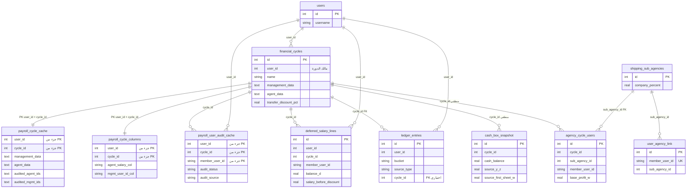
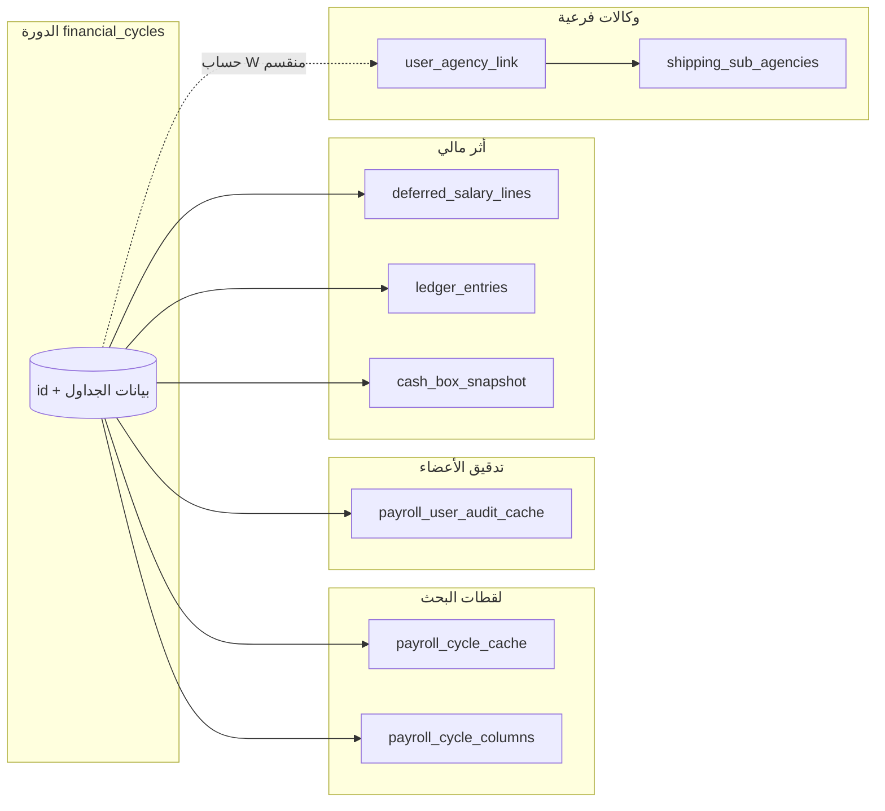
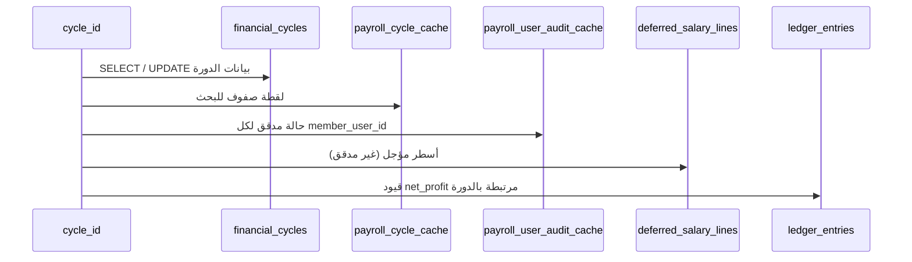

# علاقات قاعدة البيانات + تدفق التدقيق (Relations + Flow)

مستند **منفصل** عن [خريطة-التدقيق-والمنطق.md](./خريطة-التدقيق-والمنطق.md): الأول يشرح **المعنى والمنطق والـ Flow التفصيلي**؛ هذا الملف يركّز على **علاقات الجداول (Relations)** و**مخطط تدفق مختصر** يربط الكيانات ببعضها.

---

## 1. نطاق هذا المستند

| يشمل | لا يشمل بالتفصيل |
|------|------------------|
| جداول الدورات المالية، الكاش، التدقيق، المؤجل، الدفتر، لقطة الصندوق | شحن، معتمدين، صناديع (إلا إذا لامست الدورة) |
| ربط الوكالة الفرعية بـ `member_user_id` لحساب W | واجهات المستخدم |

---

## 2. مخطط علاقات (ER) — نواة التدقيق والدورة

العلاقات **المنطقية** (بدون `FOREIGN KEY` في PostgreSQL) تُشارك بخط منقط في الوصف؛ الـ **FK الصريحة** من `schema.pg.sql` تُذكر في الجدول التالي.



### 2.1 مفاتيح وقيود (ملخص)

| الجدول | المفتاح | ملاحظة |
|--------|---------|--------|
| `financial_cycles` | `id` | مركز الدورة؛ `user_id` → `users.id` (منطقي في التطبيق). |
| `payroll_cycle_cache` | `(user_id, cycle_id)` | لقطة صفوف للبحث/التدقيق؛ `cycle_id` يشير لـ `financial_cycles.id`. |
| `payroll_cycle_columns` | `(user_id, cycle_id)` | أعمدة A/D/… لكل دورة. |
| `payroll_user_audit_cache` | `(user_id, cycle_id, member_user_id)` | حالة التدقيق لكل عضو في الدورة. |
| `deferred_salary_lines` | `UNIQUE(user_id, cycle_id, member_user_id)` | مؤجل بعد خصم التحويل؛ يُستبدل عند إعادة بناء **تلك الدورة** فقط. |
| `ledger_entries` | `id` | `cycle_id` → `financial_cycles(id) ON DELETE SET NULL` (في المخطط). |
| `cash_box_snapshot` | `id` | مرتبط بـ `cycle_id` **بدون FK** في الملف؛ الاستخدام منطقي. |
| `user_agency_link` | `member_user_id` UNIQUE | لربط مستخدم إداري بوكالة فرعية (يؤثر على حساب W). |
| `agency_cycle_users` | فريد `(cycle_id, sub_agency_id, member_user_id)` | قاعدة مزامنة W للدورة. |

---

## 3. مسار تدقيق محلي منفصل (`payroll_native_*`)

هذا المسار **مستقل** عن `financial_cycles` + Google؛ دوراته في `payroll_native_cycles`.

```mermaid
erDiagram
  users {
    int id PK
  }
  payroll_native_cycles {
    int id PK
    int user_id
    string name
  }
  payroll_native_management_workbook {
    int cycle_id PK FK
    text sheets_json
  }
  payroll_native_agent_workbook {
    int cycle_id PK FK
    text sheets_json
  }
  payroll_native_user_audit {
    int user_id PK
    int native_cycle_id PK
    string member_user_id PK
    string audit_status
  }

  users ||--o{ payroll_native_cycles : "user_id"
  payroll_native_cycles ||--|| payroll_native_management_workbook : "cycle_id"
  payroll_native_cycles ||--|| payroll_native_agent_workbook : "cycle_id"
  payroll_native_cycles ||--o{ payroll_native_user_audit : "native_cycle_id FK"
```

---

## 4. Flow — ربط Relations بالعمليات (مختصر)

يُظهر كيف تتحرك البيانات بين الكيانات نفسها دون تكرار شرح [خريطة-التدقيق-والمنطق.md](./خريطة-التدقيق-والمنطق.md).



**قراءة سريعة:**

1. **`financial_cycles`** يغذّي الكاش والأعمدة والتدقيق والمؤجل.
2. **`payroll_user_audit_cache`** يحدّد مَن **مدقق**؛ مع **`deferred_salary_lines`** يُستبعد المدقق من المؤجل عند إعادة البناء.
3. **`ledger_entries`** يستقبل `audit_management_yz` / `audit_management_w` و`transfer_discount_profit` (حسب المسار).
4. **`user_agency_link` + `shipping_sub_agencies`** يدخلان في **حساب عمود W** (حصة الشركة) عند تجميع الإدارة وليس كجدول تدقيق مباشر.

---

## 5. Sequence مختصر — من `cycle_id` إلى الجداول



---

## 6. إحالة للتفاصيل

- **منطق التدقيق، التصنيف اليدوي، الـ Flow التفصيلي:** [خريطة-التدقيق-والمنطق.md](./خريطة-التدقيق-والمنطق.md)  
- **المخطط الأصلي للقاعدة:** `db/schema.pg.sql`

---

*العلاقات المنطقية بدون FK في المخطط قد تُضاف لاحقاً كقيود قاعدة إذا رُغب بتقوية التكامل المرجعي.*
